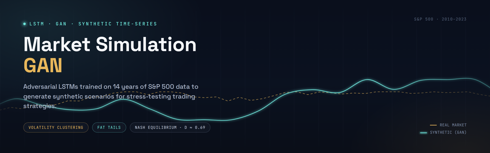
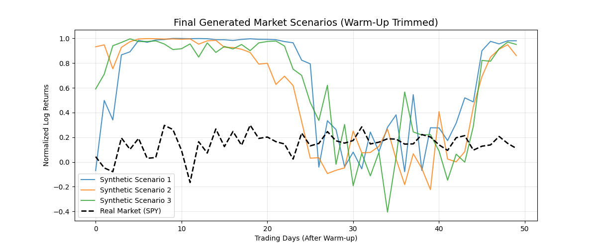
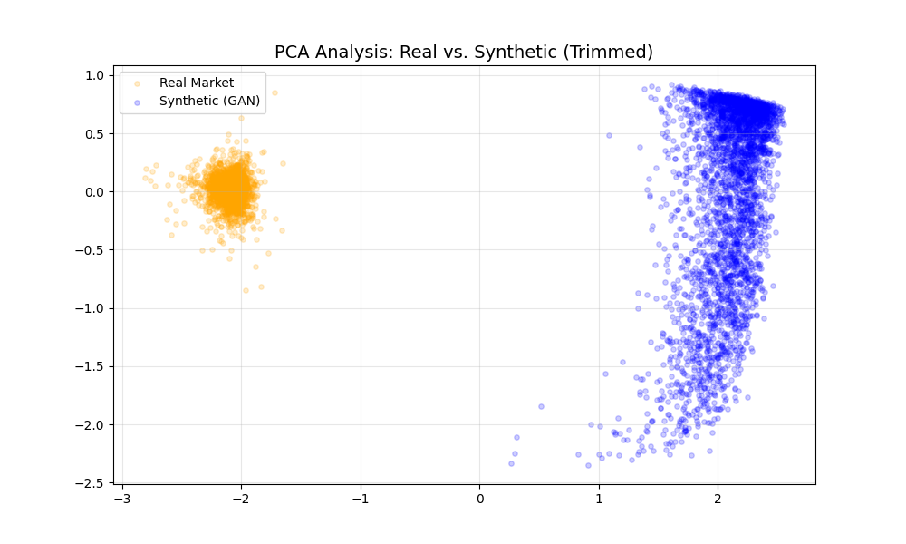

<div align="center">

<a href="report.pdf">
  
</a>

<p><em>Click the banner above to view the full analysis report</em></p>

# Generative Adversarial Networks for Market Simulation

**LSTM-GANs for synthetic S&P 500 time-series generation**


</div>

---

## 📌 Project Overview

This project uses **Deep Learning (LSTM-GANs)** to address data scarcity in financial modeling. By training a Generative Adversarial Network on 14 years of S&P 500 (SPY) daily price data, it generates high-fidelity synthetic market scenarios that preserve key statistical properties of real markets — volatility clustering and fat tails — enabling robust strategy stress-testing without overfitting to a single historical path.

## 🚀 Key Objectives

1. **Solve data scarcity** — generate unlimited synthetic financial time-series data.
2. **Preserve privacy** — produce realistic market data without revealing proprietary trading information.
3. **Enable stress testing** — simulate extreme market conditions (e.g., crashes) that occur rarely in real history.

## 🛠️ Technical Architecture

| Component | Description |
|---|---|
| **Generator (G)** | Stacked LSTM network with Batch Normalization, mapping random noise (*z*) to realistic price sequences |
| **Discriminator (D)** | LSTM-based binary classifier distinguishing real market data from generated sequences |
| **Training** | Adversarial minimax training run to Nash Equilibrium (Discriminator accuracy ≈ 50%) |
| **Post-processing** | "Warm-up trimming" to remove LSTM initialization artifacts from generated sequences |

## 📂 Repository Structure

```text
├── code/
│   ├── 1_data_loading.ipynb            # Data fetching (Yahoo Finance) & log-return transformation
│   ├── 2_gan_architecture.ipynb        # Generator & Discriminator model definitions
│   ├── 3_gan_training_improved.ipynb   # Training loop with Batch Normalization
│   └── 5_final_production.ipynb        # Inference, filtering, and visualization
├── data/                               # Processed .npy datasets and scalers
├── images/                             # Training logs, loss curves, and final PCA plots
├── models/                             # Saved Keras models (.h5)
└── output/                             # Final project report (PDF/DOCX)
```

## 📊 Results & Analysis

- **Convergence:** The model converged successfully, with Discriminator loss stabilizing near ln(2) ≈ 0.69 — the theoretical optimum at Nash Equilibrium.
- **Dynamics:** The Generator learned volatility clustering, reproducing the chaotic, non-smooth nature of daily returns rather than a flat or repetitive signal.
- **Limitations:** As shown below, synthetic and real trajectories still occupy visibly different regions of both raw return space and PCA space. This distributional offset is a known challenge for vanilla LSTM-GANs; future work will explore Wasserstein distance (WGAN-GP) to close the gap.

<p align="center">
  
  <br>
  <em>Generated synthetic scenarios (warm-up trimmed) vs. real SPY returns. Synthetic paths capture volatility clustering but sit at a different level than the real series for much of the sequence.</em>
</p>

<p align="center">
  
  <br>
  <em>PCA projection of real vs. synthetic return sequences. The two distributions form largely separate clusters, indicating room for improvement in distributional fidelity — see Future Work.</em>
</p>

## 📝 Usage

**1. Install dependencies**

```bash
pip install -r requirements.txt
```

**2. Run the pipeline**

Execute the notebooks in `code/` in numerical order (1 → 5).

---

## 📖 Citation

If this project is useful in your research, coursework, or other derivative work, please cite it and credit the original author. A [`CITATION.cff`](CITATION.cff) file is included, so GitHub also provides a **"Cite this repository"** button in the sidebar (BibTeX, APA, and other formats).

**Suggested citation:**

> Arain, S. U. R. (2026). *market-simulation-gan* (Version 1.0) [Software]. https://github.com/sanaurrehmanarain/market-simulation-gan

| | |
|---|---|
| **Author** | Sana Ur Rehman Arain |
| **Role** | Data Scientist |
| **GitHub** | [@sanaurrehmanarain](https://github.com/sanaurrehmanarain) |
| **Contact** | sana.arain.work@gmail.com |

---

## 📜 License

This project is licensed under the **MIT License** — see [LICENSE](LICENSE) for details. The license requires that the original copyright notice be retained in copies of the software.

---

<p align="center">
⭐ If this project was useful to you, consider starring the repo — it helps others discover it and supports future work.
</p>
